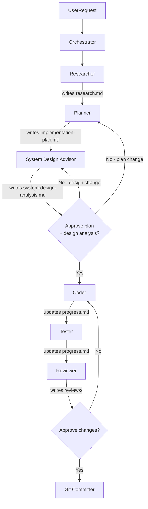

# AI-Powered Development Tools

This directory contains AI prompts, skills, rules, and plans for developing the **cashback-platform** with GitHub Copilot.

## Directory Structure

```
.github/
├── prompts/                    ← Slash commands (Copilot hardcoded path)
│   ├── create_plan.prompt.md
│   ├── implement_plan.prompt.md
│   ├── research_codebase.prompt.md
│   ├── system_design.prompt.md
│   ├── commit.prompt.md
│   ├── review_plan.prompt.md
│   ├── text_sanitizer.prompt.md
│   └── compress.prompt.md
├── ai/                         ← All AI artifacts (you are here)
│   ├── rules/
│   │   ├── codebase/
│   │   │   ├── rule-1-clean-architecture.md
│   │   │   └── rule-2-transaction-pattern.md
│   │   └── language/go/
│   │       ├── rule-3-go-style.md
│   │       ├── rule-4-testing.md
│   │       └── rule-5-error-handling.md
│   ├── skills/
│   │   ├── orchestrator/SKILL.md
│   │   ├── researcher/SKILL.md
│   │   ├── planner/SKILL.md
│   │   ├── coder/SKILL.md
│   │   ├── tester/SKILL.md
│   │   ├── reviewer/SKILL.md
│   │   ├── system-design-advisor/SKILL.md
│   │   ├── git-committer/SKILL.md
│   │   ├── context-compressor/SKILL.md
│   │   └── text-sanitizer/SKILL.md
│   └── README.md
├── scripts/                    ← CI/infra scripts only
└── workflows/
```

## How to Use Skills via Copilot Chat

Skills are invoked directly in Copilot Chat. The pattern is always the same:

```
Read and follow .github/ai/skills/{skill}/SKILL.md, then <your request>.
```

### Examples

**Implement a feature (full workflow):**
```
Read and follow .github/ai/skills/orchestrator/SKILL.md, then implement the new authentication feature.
```

**Research only:**
```
Read and follow .github/ai/skills/researcher/SKILL.md, then document how the cashback domain works.
```

**Run system design analysis on the active plan:**
```
Read and follow .github/ai/skills/system-design-advisor/SKILL.md, then analyse the active plan.
```

**Commit staged changes:**
```
Read and follow .github/ai/skills/git-committer/SKILL.md, then commit my changes.
```

**Code review:**
```
Read and follow .github/ai/skills/reviewer/SKILL.md, then review the changes in internal/app/cashback/.
```

**Implement a specific plan phase:**
```
Read and follow .github/ai/skills/coder/SKILL.md, then implement phase 2 of ~/ai-plans/{repo-name}/add-cashback-endpoint/implementation-plan.md.
```

**Write tests:**
```
Read and follow .github/ai/skills/tester/SKILL.md, then write tests for the phase just implemented.
```

**Compress session to avoid context loss:**
```
/compress
```
Or manually:
```
Read and follow .github/ai/skills/context-compressor/SKILL.md, then compress this session.
```

**Resume a compressed session in a new chat:**
```
Read and follow .github/ai/skills/orchestrator/SKILL.md, then resume plan {slug}.
Before doing anything, read ~/ai-plans/{repo-name}/{slug}/session-summary.md for full context.
```

## Skill Workflow



## Skills Reference

| Skill | Role | Invoke with |
|---|---|---|
| [orchestrator](./skills/orchestrator/SKILL.md) | Entry point — delegates, never codes | `skills/orchestrator/SKILL.md` |
| [researcher](./skills/researcher/SKILL.md) | Locates and analyzes codebase (read-only) | `skills/researcher/SKILL.md` |
| [planner](./skills/planner/SKILL.md) | Translates research into phased plan | `skills/planner/SKILL.md` |
| [system-design-advisor](./skills/system-design-advisor/SKILL.md) | Analyses atomicity, idempotency, consistency, concurrency, resilience, EDA/CQRS/SAGA, CAP theorem, database selection | `skills/system-design-advisor/SKILL.md` |
| [coder](./skills/coder/SKILL.md) | Implements Go code (with approval) | `skills/coder/SKILL.md` |
| [tester](./skills/tester/SKILL.md) | Writes and runs tests | `skills/tester/SKILL.md` |
| [reviewer](./skills/reviewer/SKILL.md) | Code review: BLOCKER/SUGGESTION findings | `skills/reviewer/SKILL.md` |
| [git-committer](./skills/git-committer/SKILL.md) | Organizes and executes commits (with approval) | `skills/git-committer/SKILL.md` |
| [context-compressor](./skills/context-compressor/SKILL.md) | Compresses session into `session-summary.md` | `/compress` or `skills/context-compressor/SKILL.md` |
| [text-sanitizer](./skills/text-sanitizer/SKILL.md) | Post-processing pass on any user-facing text | `skills/text-sanitizer/SKILL.md` |

## System Design Advisor — 7 Lenses

The System Design Advisor runs automatically after Planner for all Standard and Complex tasks.
It can also be invoked directly via `/system_design`.

| Lens | What it checks |
|---|---|
| 1. Atomicity | Transactions, dual-write risks, external calls inside DB transactions |
| 2. Idempotency | Deduplication guards, safe retry guarantees |
| 3. Consistency | Data store divergence, strong vs eventual consistency |
| 4. Concurrency | Race conditions, deadlocks, locking strategy (SELECT FOR UPDATE, optimistic lock, distributed lock + fencing token) |
| 5. Resilience | Retry bounds, dead-letter queues, circuit breakers, scalability bottlenecks |
| 6. Architectural Patterns | EDA, CQRS, SAGA — when the current design creates a problem each pattern would solve |
| 7. CAP Theorem and Database Selection | CP vs AP trade-off, relational vs document vs key-value vs columnar vs time-series vs graph vs search |

Output: `~/ai-plans/{repo-name}/{slug}/system-design-analysis.md` — developer approval required before Coder starts.

---

**See also:** [Project README](../../README.md) | [copilot-instructions.md](../copilot-instructions.md)
