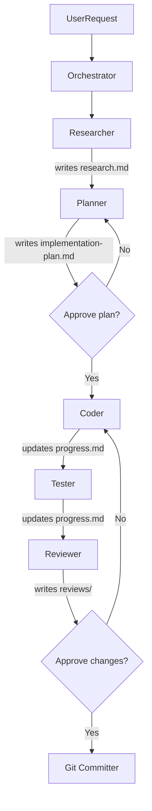

# AI-Powered Development Tools

This directory contains AI prompts, skills, rules, and plans for developing the **cashback-platform** with GitHub Copilot.

## Directory Structure

```
.github/
├── prompts/                    ← Slash commands (Copilot hardcoded path)
│   ├── create_plan.prompt.md
│   ├── implement_plan.prompt.md
│   ├── research_codebase.prompt.md
│   ├── commit.prompt.md
│   ├── review_plan.prompt.md
│   └── compress.prompt.md
├── ai/                         ← All AI artifacts (you are here)
│   ├── rules/
│   │   ├── codebase/
│   │   │   ├── rule-1-clean-architecture.md
│   │   │   └── rule-2-transaction-pattern.md
│   │   └── language/go/
│   │       ├── rule-3-go-style.md
│   │       ├── rule-4-testing.md
│   │       └── rule-5-error-handling.md
│   ├── skills/
│   │   ├── orchestrator/SKILL.md
│   │   ├── researcher/SKILL.md
│   │   ├── planner/SKILL.md
│   │   ├── coder/SKILL.md
│   │   ├── tester/SKILL.md
│   │   ├── reviewer/SKILL.md
│   │   ├── git-committer/SKILL.md
│   │   ├── context-compressor/SKILL.md
│   │   └── text-sanitizer/SKILL.md
│   └── README.md
├── scripts/                    ← CI/infra scripts only
└── workflows/
```

## How to Use Skills via Copilot Chat

Skills are invoked directly in Copilot Chat. The pattern is always the same:

```
Read and follow .github/ai/skills/{skill}/SKILL.md, then <your request>.
```

### Examples

**Implement a feature (full workflow):**
```
Read and follow .github/ai/skills/orchestrator/SKILL.md, then implement the new authentication feature.
```

**Research only:**
```
Read and follow .github/ai/skills/researcher/SKILL.md, then document how the cashback domain works.
```

**Commit staged changes:**
```
Read and follow .github/ai/skills/git-committer/SKILL.md, then commit my changes.
```

**Open a Pull Request:**
```
Read and follow .github/ai/skills/pr-creator/SKILL.md, then open a PR for my current branch.
```

**Code review:**
```
Read and follow .github/ai/skills/reviewer/SKILL.md, then review the changes in internal/app/cashback/.
```

**Implement a specific plan phase:**
```
Read and follow .github/ai/skills/coder/SKILL.md, then implement phase 2 of ~/ai-plans/{repo-name}/add-cashback-endpoint/implementation-plan.md.
```

**Write tests:**
```
Read and follow .github/ai/skills/tester/SKILL.md, then write tests for the phase just implemented.
```


**Compress session to avoid context loss:**
```
/compress
```
Or manually:
```
Read and follow .github/ai/skills/context-compressor/SKILL.md, then compress this session.
```

**Resume a compressed session in a new chat:**
```
Read and follow .github/ai/skills/orchestrator/SKILL.md, then resume plan {slug}.
Before doing anything, read ~/ai-plans/{repo-name}/{slug}/session-summary.md for full context.
```

## Skill Workflow



## Skills Reference

| Skill | Role | Rules Read | Invoke with |
|---|---|---|---|
| [orchestrator](./skills/orchestrator/SKILL.md) | Entry point — delegates, never codes | rule-1, rule-2 | `skills/orchestrator/SKILL.md` |
| [researcher](./skills/researcher/SKILL.md) | Locates + analyzes codebase (read-only) | rule-1, rule-2 | `skills/researcher/SKILL.md` |
| [planner](./skills/planner/SKILL.md) | Translates research into phased plan | rule-1, rule-2 | `skills/planner/SKILL.md` |
| [coder](./skills/coder/SKILL.md) | Implements Go code (with approval) | all 5 rules | `skills/coder/SKILL.md` |
| [tester](./skills/tester/SKILL.md) | Writes + runs tests | rule-4, rule-5 | `skills/tester/SKILL.md` |
| [reviewer](./skills/reviewer/SKILL.md) | Code review: BLOCKER/SUGGESTION findings | all 5 rules | `skills/reviewer/SKILL.md` |
| [git-committer](./skills/git-committer/SKILL.md) | Organizes + executes commits (with approval) | — | `skills/git-committer/SKILL.md` |
| [context-compressor](./skills/context-compressor/SKILL.md) | Compresses session into `session-summary.md` for context-safe re-attach | — | `/compress` or `skills/context-compressor/SKILL.md` |

## Plan Lifecycle

Plans live in `~/ai-plans/{repo-name}/{slug}/` — **completely outside the repository**.

```bash
# Path for this repo
~/ai-plans/cashback-platform/{slug}/
```

### Plans are local-only

Plans are stored in the user's home directory. This means:

- **Immune to all git operations** — branch switch, stash, rebase, `git clean -fdx` — nothing touches them
- **Survive repo deletion** — plans outlive the local clone
- **No gitignore needed** — completely outside git's scope
- **Zero setup** — plans directory is created automatically on first use by any skill
- **Portable via compression** — run `/compress` to generate `session-summary.md`; share that file to resume on another machine

```
~/ai-plans/
└── cashback-platform/      ← one folder per repo
    └── {slug}/                        ← one folder per plan
        ├── brief.md
        ├── research.md
        ├── implementation-plan.md
        ├── progress.md
        ├── session-summary.md
        └── reviews/
```

The `.github/ai/plans/` directory no longer exists in the repo — plans are fully external.

### Context Compression

GitHub Copilot does not expose the token counter to the agent, so compression is triggered
**manually or by the agent at phase checkpoints**.

**When to compress:**
- The context window indicator (visible in the chat UI) is above ~70%
- A long session covered research + planning + multiple coding phases
- You're about to start a new chat and want to preserve state

**How to trigger:**
```
/compress
```

The compressor writes `~/ai-plans/{repo-name}/{slug}/session-summary.md` with a ready-to-paste
re-attach prompt. Start the next session by pasting that prompt — the agent will load the
summary and resume exactly where you left off.

**Proactive offers:** the Orchestrator and Coder will offer to compress after 3+ phases
complete. The offer is non-blocking — ignore it and progress continues.

### Managing Status

`progress.md` is the single source of truth — no separate `.status` or `.priority` files, no helper scripts.

The Orchestrator reads `progress.md` at the start of every task and routes based on the `## Status` line:

| Status | What happens |
|--------|-------------|
| File absent | Start from scratch |
| `IN_PROGRESS` | Resume from last completed phase |
| `REVIEW` | Hand off to Reviewer |
| `DONE` | Report complete, ask before reopening |

**Format**:

```markdown
## Status
IN_PROGRESS

## Phase 1 — Domain Model ✅
- [x] Created domain entity
- [x] Tests passing

## Phase 2 — Use Case ⏳
- [ ] UseCase struct
- [ ] Unit tests
```

Valid statuses: `IN_PROGRESS` → `REVIEW` → `DONE`

## Rules System

Every skill reads rules explicitly via `read_file` at the start of execution:

| Rule | Content |
|---|---|
| [rule-1-clean-architecture](./rules/codebase/rule-1-clean-architecture.md) | Layer constraints, domain/usecase/repo/handler rules |
| [rule-2-transaction-pattern](./rules/codebase/rule-2-transaction-pattern.md) | Transaction pattern, interface-only `TransactionManager` |
| [rule-3-go-style](./rules/language/go/rule-3-go-style.md) | Grouped decls, no else, `any`, `errors.Is()`, naming |
| [rule-4-testing](./rules/language/go/rule-4-testing.md) | Table-driven, mockery `EXPECT()`, `//go:build integration` |
| [rule-5-error-handling](./rules/language/go/rule-5-error-handling.md) | Never log+return, domain error types, wrapping |

---

**See also:** [Project README](../../README.md) | [copilot-instructions.md](../copilot-instructions.md)


