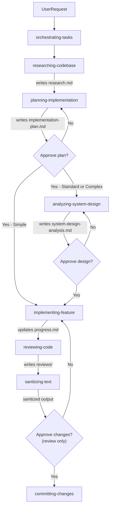

# Orchestrating Tasks

Single entry point for all AI-assisted tasks in this project. Detects task complexity,
selects and delegates to the right skills, manages plan state, and checkpoints with the user.
Never writes code or implementation directly.

## When to use

- User asks to implement a feature, fix a bug, or plan a change
- User asks to research, plan, implement, or review something
- User asks to resume an existing plan
- Any task that involves multiple skills or codebase analysis

## Steps

### Step 0 — Setup

1. Ensure the plans symlink exists — run setup from `.github/skills/references/plans-setup.md`
2. If a re-attach prompt references `.github/ai/skills/`, correct to `.github/skills/` — legacy path from before the skills migration.
### Plan Discovery

When the user does not provide an explicit slug, discover the active plan by scanning `.github/plans/` and reading `progress.md` in each directory.

| Situation | Action |
|-----------|--------|
| User provided full slug | Use it directly |
| Exactly 1 plan with `IN_PROGRESS` | Use it automatically, inform the user |
| Multiple plans with `IN_PROGRESS` | List them and ask which to use |
| No `IN_PROGRESS` plan found | Inform user — offer to create a new plan or reopen a `DONE` one |

Never assume a plan exists without checking. Always run the discovery step first.

### Step 2 — Read Plan Status

Read `.github/plans/{slug}/progress.md`. Route based on the `## Status` line:

| Status | Action |
|--------|--------|
| File does not exist, or `## Status` is absent | Start from scratch — full workflow (researching-codebase -> planning-implementation -> ...) |
| `IN_PROGRESS` | Read the phase checkboxes to find the last completed phase, resume from there. Do not re-run completed phases. |
| `REVIEW` | Skip straight to reviewing-code. Read `implementation-plan.md` and `progress.md` for context. |
| `DONE` | Report to the user that this plan is complete. Ask: "This plan is marked DONE. Do you want to reopen it?" Do not proceed without confirmation. |

When reopening a `DONE` plan, update the `## Status` line in `progress.md` back to `IN_PROGRESS` and ask the user where to restart from.

### Step 3 — Delegate

Create `.github/plans/{slug}/brief.md` with context and acceptance criteria, then delegate to skills in sequence. Manage plan state via `progress.md`. Checkpoint with the user before any destructive step. Never write production code, tests, or commit directly.



> **Note:** Checkpoint2 approves code review only. CommittingChanges still requires separate explicit user authorization before executing any git commit.

## Complexity Classification

Before delegating, classify the task:

| Level | Criteria | Skill chain |
|---|---|---|
| Simple | Single file change, typo/config fix | implementing-feature only |
| Standard | New endpoint, bug fix touching 3 or fewer layers | planning-implementation → **analyzing-system-design** → implementing-feature → reviewing-code |
| Complex | New domain, cross-domain, migration + multiple layers | All skills — analyzing-system-design is mandatory, reviewing-code with parallel models |

> **analyzing-system-design is not optional for Standard and Complex tasks.**
> The Coder must not start until `system-design-analysis.md` is approved by the developer.
> Skill: `.github/skills/analyzing-system-design/SKILL.md`

## Error Recovery

- If MCP tools are unavailable (issue tracker unreachable, wiki timeout): inform the user and proceed with local-only context (plan files, codebase). Do not block the workflow.
- If a skill fails mid-execution: capture the error, update `progress.md` with the failure point, and present options to the user (retry, skip, abort).

## Task Type -> Skill Matrix

| Task Type | Skills Invoked |
|---|---|
| New endpoint/feature | researching-codebase → planning-implementation → **analyzing-system-design** → implementing-feature → reviewing-code → sanitizing-text |
| New domain / cross-service | researching-codebase → planning-implementation → **analyzing-system-design** → implementing-feature → reviewing-code → sanitizing-text |
| Bug fix | researching-codebase → implementing-feature → reviewing-code → sanitizing-text |
| Research only | researching-codebase → sanitizing-text |
| Code review | reviewing-code → sanitizing-text |
| Commit only | committing-changes |

## Approval Checkpoints

Skills that produce artefacts requiring developer decision must pause and wait for explicit approval. The orchestrating-tasks skill must enforce this — never bypass any approval step.

| Skill | Requires approval before |
|---|---|
| `analyzing-system-design` | Coder starts any phase — wait for developer to approve `system-design-analysis.md` |
| `committing-changes` | Any `git commit` or `git push` |
| `creating-pull-request` | Any `gh pr create` call |

---

## Output Contract

For every new task, create:

```
.github/plans/{slug}/
├── brief.md          ← orchestrating-tasks creates (context + AC)
└── progress.md       ← orchestrating-tasks creates with ## Status: IN_PROGRESS header
```

## State Management

Status is tracked in the `## Status` line at the top of `progress.md`. Only orchestrating-tasks and the skills listed below may write to it.

### Transition Map

| From | To | Who transitions | When |
|------|----|----------------|------|
| _(file absent)_ | `IN_PROGRESS` | orchestrating-tasks | When `brief.md` is created and the plan is started |
| `IN_PROGRESS` | `REVIEW` | implementing-feature | After all phases complete, linter passes, and all tests pass |
| `REVIEW` | `IN_PROGRESS` | orchestrating-tasks | When reviewing-code finds blockers — sends back to implementing-feature |
| `REVIEW` | `DONE` | reviewing-code | After the user explicitly approves the review (no blockers, or all blockers resolved) |
| `DONE` | `IN_PROGRESS` | orchestrating-tasks | Only when user explicitly asks to reopen the plan |

### progress.md Format

```markdown
## Status
IN_PROGRESS

## Phase 1 — Domain Model ✅
- [x] Created domain entity
- [x] Tests passing

## Phase 2 — Use Case ⏳
- [x] UseCase struct
- [ ] Unit tests
```

Valid statuses: `IN_PROGRESS` | `REVIEW` | `DONE`

To update status, edit the line immediately below `## Status` in `progress.md`.

## Context Compression

Token context is finite. The orchestrating-tasks skill must offer compression at every user-facing checkpoint
when any of these is true:

- `/context` shows 70% or more usage
- The session spans research + planning + coding (multi-skill)
- The user explicitly asks

Offer format (append at the end of a phase summary, non-blocking):

```
Context is at {N}% — approaching the safe limit (70%). Compress now to avoid degradation?
Saves context — lets you resume cleanly in a new chat.
Reply "yes" or use /compress.
```

Skill: `.github/skills/compressing-context/SKILL.md`

---

## Slug Convention

Derive slug from the branch name or a short description of the task:
- `add-user-endpoint`
- `fix-login-error`
- `update-readme`
- Use kebab-case, lowercase

## Permissions

- ✅ Invoke any skill
- ✅ Read any file
- ✅ Create `brief.md`, `progress.md`
- ✅ Update `## Status` in `progress.md`
- ❌ Write production code
- ❌ Commit without EXPLICIT USER authorization (code review approval ≠ commit authorization)
- ❌ Dispatch committing-changes and assume the user's prior approval to 'proceed with implementation' covers commit authorization — it does not
- ❌ Skip user checkpoints

