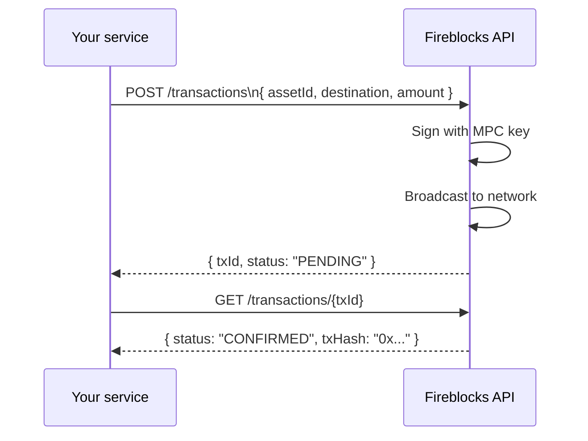
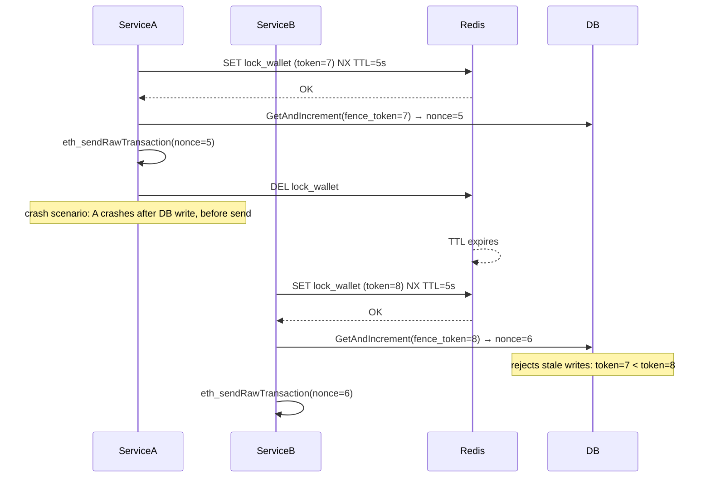

# Production Blockchain Engineering: Web3 Concepts

**Index**: [Chain Reorganization](#18-chain-reorganization) · [Deposit Processing & Monitoring](#19-deposit-processing-and-monitoring) · [Confirmation Tracking](#20-transaction-confirmation-tracking) · [Custody Providers](#21-custody-providers-fireblocks-and-bitgo) · [Multi-Chain Architecture](#22-multi-chain-architecture-patterns) · [Distributed Locking](#23-distributed-locking-in-blockchain-services)

---

## 18. Chain Reorganization

**What it is**: a chain reorganization (reorg) occurs when a block that was part of the
"longest chain" is replaced by a competing chain with more accumulated work (PoW) or stake (PoS).
Transactions in the orphaned block are reverted to the mempool. They are treated as if they never happened.

**Why it matters for payment/exchange systems**: if you credit a user's account after seeing
a transaction in block N, and block N is later orphaned, you have credited funds that were never
confirmed. This is a classic attack vector and an operational risk.

**Ethereum reorg risk**:
- Under PoS (since The Merge), deep reorgs are extremely rare but shallow reorgs (1–2 blocks) still occur
- The "finalized" beacon chain checkpoint (every 2 epochs, ~13 min) makes reorgs mathematically impossible
- Production systems typically wait for 12–64 confirmations before finalizing

**Solana reorg risk**:
- Tower BFT provides mathematical finality at `finalized` commitment
- Slots can be *skipped* (no block produced), but confirmed slots are rarely reverted
- Using `finalized` commitment eliminates practical reorg risk on Solana

**How to detect a reorg in code**:

```go
// After waiting N blocks, re-fetch the transaction receipt
receipt, err := ethClient.TransactionReceipt(ctx, txHash)
if err == ethereum.NotFound {
    // Transaction disappeared — possible reorg
    // Strategy: re-check after a few more blocks; if still missing, mark as REORGED
}
if receipt.BlockNumber != expectedBlockNumber {
    // Transaction was re-included in a different block — shallow reorg, re-count confirmations
}
```

**State machine response to reorg**:
```text
confirming -> reorged -> pending (re-submit with same nonce and payload)
```

The original transaction may or may not be re-included by the network. If not, the nonce
can be reused. Safe re-submission relies on idempotency via `idempotency_key`.

**Where it appears**: `internal/infra/ethereum/confirmation_watcher.go` (Etapa 1B).

---

## 19. Deposit Processing and Monitoring

**What it is**: detecting when an external address sends tokens or native currency to a wallet
your system controls. This is core to any exchange, wallet, or payment processor.

**Two architectural models**:

| Model | How | Pros | Cons |
|---|---|---|---|
| **Pull (polling)** | Periodically query blocks/events | Simple, no external dep | Latency proportional to poll interval, RPC cost |
| **Push (webhooks/streams)** | Alchemy, Infura, or node subscription sends events | Low latency, efficient | Dependency on provider, webhook reliability |

This project uses **polling** (self-contained, no external dependency).

**Ethereum deposit detection**:

The ERC-20 standard emits a `Transfer(from, to, amount)` event on every token movement.
Detecting deposits = filtering this event for addresses you control:

```go
query := ethereum.FilterQuery{
    FromBlock: big.NewInt(int64(lastProcessedBlock)),
    ToBlock:   nil, // latest
    Addresses: []common.Address{contractAddress},
    Topics: [][]common.Hash{
        {crypto.Keccak256Hash([]byte("Transfer(address,address,uint256)"))},
    },
}
logs, _ := ethClient.FilterLogs(ctx, query)
for _, log := range logs {
    event, _ := contract.ParseTransfer(log)
    if isMonitored(event.To) {
        handleDeposit(event)
    }
}
```

**Key production concern**: always persist `lastProcessedBlock` to the DB after processing.
On service restart, resume from `lastProcessedBlock`, not from the current block. Otherwise,
you miss blocks processed during the downtime.

**Solana deposit detection**:

Solana does not have `FilterLogs`. Instead, use `getSignaturesForAddress`:

```go
sigs, _ := client.GetSignaturesForAddress(ctx, mintPubKey, &rpc.GetSignaturesForAddressOpts{
    Until: lastProcessedSignature, // pagination
    Commitment: rpc.CommitmentConfirmed,
})
for _, sig := range sigs {
    tx, _ := client.GetTransaction(ctx, sig.Signature, rpc.CommitmentConfirmed)
    // parse SPL Token instructions to find Transfer or MintTo targeting your addresses
}
```

**Where it appears**: `internal/infra/ethereum/deposit_monitor.go` and
`internal/infra/solana/deposit_monitor.go` (Etapa 1B).

---

## 20. Transaction Confirmation Tracking

**The problem**: after submitting a transaction, you need to know when it is safe to act on
(credit a user, release a withdrawal, update an order). "Safe" is defined by the confirmation
policy, which differs per chain.

**Confirmation watcher pattern**:

```go
// Poll submitted transactions every N seconds
for _, tx := range repo.FindByStatus("submitted") {
    currentBlock, _ := ethClient.BlockNumber(ctx)
    receipt, err := ethClient.TransactionReceipt(ctx, tx.Hash)

    if err == ethereum.NotFound && currentBlock - tx.SubmittedBlock > staleness {
        repo.MarkReorged(tx.ID)
        continue
    }
    if receipt.Status == 0 {
        repo.MarkFailed(tx.ID, "REVERTED", "")
        continue
    }

    confirmations := currentBlock - receipt.BlockNumber.Uint64()
    if confirmations >= minConfirmations {
        repo.MarkConfirmed(tx.ID, receipt.BlockNumber.Int64(), receipt.GasUsed)
    }
}
```

**Solana finality watcher**:

```go
statuses, _ := client.GetSignatureStatuses(ctx, []solana.Signature{sig}, true)
status := statuses.Value[0]
if status.Err != nil {
    repo.MarkFailed(tx.ID, "REVERTED", status.Err.Error())
} else if status.ConfirmationStatus == rpc.ConfirmationStatusFinalized {
    repo.MarkConfirmed(tx.ID, status.Slot)
}
```

**Anomaly detection**: flag transactions that are stuck in `submitted` for longer than
expected (e.g., `submitted_at < NOW() - INTERVAL '10 minutes'`). Causes include:
- Nonce gap (Ethereum): a previous tx with a lower nonce was never mined
- Gas price too low (Ethereum): mempool evicted the tx
- Expired blockhash (Solana): transaction exceeded its validity window

**Where it appears**: `internal/infra/ethereum/confirmation_watcher.go` and
`internal/infra/solana/finality_watcher.go` (Etapa 1B).

---

## 21. Custody Providers: Fireblocks and BitGo

**What they are**: custody providers manage private keys and transaction signing on behalf
of your system. Instead of your code holding private keys (even in HSMs), the key never
leaves the custody provider's infrastructure.

**Why they exist**:
- Private key security: a leaked key means irreversible loss of all funds
- Regulatory compliance: MPC (Multi-Party Computation) and HSM-backed keys satisfy auditors
- Policy enforcement: transaction limits, whitelists, approval workflows
- Multi-sig: require N-of-M signers for high-value transactions

**How integration works** (Fireblocks example):



**Key difference from self-custody**:
- You never hold the private key
- You never call `eth_sendRawTransaction` directly
- You call the custody provider's API; they handle signing and broadcasting
- You poll their API for status, not the blockchain directly (though you can also verify on-chain)

**MPC (Multi-Party Computation)**: Fireblocks uses MPC-CMP, a cryptographic protocol where
the private key is split into shares across multiple parties. No single party ever has the
full key. Signing requires a threshold of parties to cooperate. A leaked share is useless.

**Comparison**:

| Property | Self-custody (this project) | Fireblocks / BitGo |
|---|---|---|
| Key location | Config / HSM | MPC shards, never assembled |
| Integration | go-ethereum direct | REST API |
| Tx signing | `keystore.Sign()` | `POST /transactions` |
| Audit trail | Your DB | Custody provider dashboard |
| Regulatory fit | PoC / low-value | Production / compliance |

In production, replace the self-managed wallet with a Fireblocks integration. The `ChainClient`
interface already abstracts signing. Swapping the implementation does not touch the business
logic layer.

---

## 22. Multi-Chain Architecture Patterns

**The challenge**: each blockchain has different APIs, transaction models, finality mechanisms,
and token standards. A naive implementation creates a separate, duplicated service per chain.

**The solution**: a `ChainClient` interface that abstracts chain-specific behavior:

```go
type ChainClient interface {
    ChainID()    ChainID
    MintToken(ctx context.Context, req MintTokenRequest) (*MintTokenResult, error)
    GetBalance(ctx context.Context, walletAddress string) (*BalanceResult, error)
    GetTransaction(ctx context.Context, txHash string) (*TransactionResult, error)
    WatchDeposits(ctx context.Context, addresses []string, handler DepositHandler) error
}
```

**Chain registry pattern**:

```go
type ChainRegistry struct {
    clients map[ChainID]ChainClient
}

func (r *ChainRegistry) Get(id ChainID) (ChainClient, error) {
    c, ok := r.clients[id]
    if !ok {
        return nil, fmt.Errorf("unsupported chain: %s", id)
    }
    return c, nil
}
```

Adding a new chain (e.g., XRP) = implement `ChainClient`, register in the registry.
Zero changes to the gRPC server, use cases, or business logic.

**Key abstraction decisions**:

| Decision | Rationale |
|---|---|
| `TokenAmount string` (not `*big.Int`) | Cross-chain: Ethereum uses wei (10^18 units), Solana uses token base units (10^9). String avoids overflow and is chain-neutral. |
| `BlockReference int64` (not `BlockNumber`) | Ethereum = block number, Solana = slot number. Same field, different semantics per chain. |
| `TransactionHash string` (not `[]byte`) | ETH uses 0x-prefixed hex (66 chars), Solana uses base58 signature (88 chars). String handles both. |

**Chain-specific concerns that must NOT leak into the interface**:
- Nonce (Ethereum only)
- Recent blockhash (Solana only)
- ATA creation (Solana only)
- Gas estimation (Ethereum only)
- ed25519 vs secp256k1 signing (handled inside each implementation)

**Where it appears**: `internal/chain/client.go` and `internal/chain/registry.go` (Etapa 1B).

---

## 23. Distributed Locking in Blockchain Services

Blockchain services have a specific concurrency problem: the **nonce** (Ethereum) must be
issued sequentially without gaps. If two goroutines, or two service replicas, both read
nonce=5 and submit, one will fail with "nonce too low" and create a nonce gap.

**The naive approach (wrong)**:

```go
// WRONG: SELECT FOR UPDATE only works for single-instance
nonce := db.Lock("SELECT ... FOR UPDATE")
eth.Send(tx{nonce: nonce})
db.Unlock()
```

This fails with multiple replicas because `SELECT FOR UPDATE` only serialises within one
database connection. Two instances each hold their own connection.

**The correct approach: Redis distributed lock + fencing token**:



**Why fencing tokens**: a process can resume after a GC pause or network partition even after
its lock expired. Without fencing, it would overwrite the new lock holder's work. The fencing
token, a monotonically increasing integer, makes the DB the arbiter: it rejects any write
with a token lower than the last accepted token.

**Implementation with Redis + PostgreSQL**:

```go
// Acquire lock (atomic SET NX with TTL)
token, err := redis.SetNX(ctx, lockKey, newToken, ttl)

// Use token as a fencing guard in the DB
db.Exec(`UPDATE wallet_nonces
         SET current_nonce = current_nonce + 1, fence_token = $1
         WHERE wallet_address = $2 AND fence_token < $1
         RETURNING current_nonce`, token, walletAddress)
// If 0 rows updated: someone else wrote with a higher token → retry
```

**Solana has no nonce problem**: recent blockhash expires independently per transaction.
Multiple goroutines can build transactions in parallel with no serialisation needed.
Idempotency is still required (via `idempotency_key`) but the lock is not.

**Where it appears**: `internal/repository/nonce/repository.go` (Etapa 1.3).
