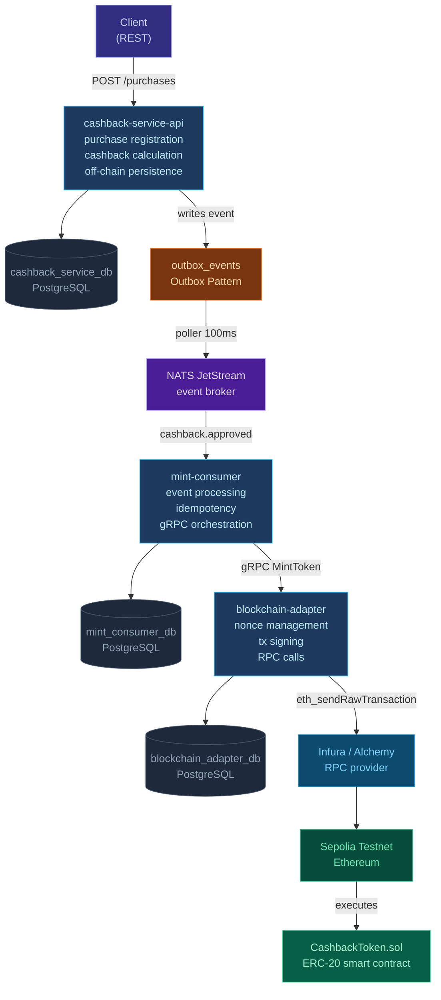

# High-Level System Flow

How a purchase becomes an on-chain token.

```mermaid
flowchart TD
    CLIENT["Client\n(REST)"]
    API["cashback-service-api\npurchase registration\ncashback calculation\noff-chain persistence"]
    DB1[("cashback_service_db\nPostgreSQL")]
    OUTBOX["outbox_events\nOutbox Pattern"]
    NATS["NATS JetStream\nevent broker"]
    MINT["mint-consumer\nevent processing\nidempotency\ngRPC orchestration"]
    DB2[("mint_consumer_db\nPostgreSQL")]
    ADAPTER["blockchain-adapter\nnonce management\ntx signing\nRPC calls"]
    DB3[("blockchain_adapter_db\nPostgreSQL")]
    INFURA["Infura / Alchemy\nRPC provider"]
    CHAIN["Sepolia Testnet\nEthereum"]
    CONTRACT["CashbackToken.sol\nERC-20 smart contract"]

    CLIENT -->|POST /purchases| API
    API --> DB1
    API -->|writes event| OUTBOX
    OUTBOX -->|poller 100ms| NATS
    NATS -->|cashback.approved| MINT
    MINT --> DB2
    MINT -->|gRPC MintToken| ADAPTER
    ADAPTER --> DB3
    ADAPTER -->|eth_sendRawTransaction| INFURA
    INFURA --> CHAIN
    CHAIN -->|executes| CONTRACT

    style CLIENT   fill:#312e81,color:#c7d2fe,stroke:#6366f1
    style API      fill:#1e3a5f,color:#bae6fd,stroke:#38bdf8
    style DB1      fill:#1e293b,color:#94a3b8,stroke:#475569
    style OUTBOX   fill:#78350f,color:#fed7aa,stroke:#f97316
    style NATS     fill:#4a1d96,color:#ddd6fe,stroke:#a78bfa
    style MINT     fill:#1e3a5f,color:#bae6fd,stroke:#38bdf8
    style DB2      fill:#1e293b,color:#94a3b8,stroke:#475569
    style ADAPTER  fill:#1e3a5f,color:#bae6fd,stroke:#38bdf8
    style DB3      fill:#1e293b,color:#94a3b8,stroke:#475569
    style INFURA   fill:#0c4a6e,color:#7dd3fc,stroke:#0284c7
    style CHAIN    fill:#064e3b,color:#6ee7b7,stroke:#10b981
    style CONTRACT fill:#065f46,color:#a7f3d0,stroke:#34d399
```

