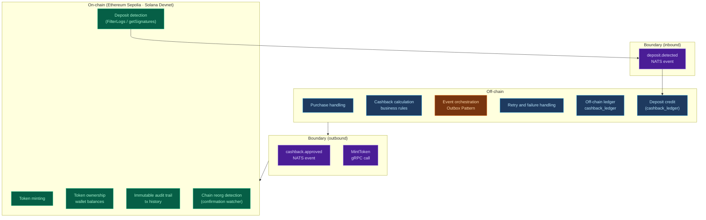

# Off-chain vs On-chain Responsibilities

<!-- On-chain side covers multiple chains: Ethereum (Sepolia) and Solana (Devnet) -->

```mermaid
flowchart TD
    subgraph OFFCHAIN["Off-chain"]
        direction TB
        OC1["Purchase handling"]
        OC2["Cashback calculation\nbusiness rules"]
        OC3["Event orchestration\nOutbox Pattern"]
        OC4["Retry and failure handling"]
        OC5["Off-chain ledger\ncashback_ledger"]
        OC6["Deposit credit\n(cashback_ledger)"]
    end

    subgraph BOUNDARY["Boundary (outbound)"]
        direction TB
        B1["cashback.approved\nNATS event"]
        B2["MintToken\ngRPC call"]
    end

    subgraph ONCHAIN["On-chain (Ethereum Sepolia · Solana Devnet)"]
        direction TB
        ON1["Token minting"]
        ON2["Token ownership\nwallet balances"]
        ON3["Immutable audit trail\ntx history"]
        ON4["Deposit detection\n(FilterLogs / getSignatures)"]
        ON5["Chain reorg detection\n(confirmation watcher)"]
    end

    subgraph BOUNDARY2["Boundary (inbound)"]
        direction TB
        B3["deposit.detected\nNATS event"]
    end

    OFFCHAIN --> BOUNDARY --> ONCHAIN
    ON4 --> B3 --> OC6

    style OC1 fill:#1e3a5f,color:#bae6fd,stroke:#38bdf8
    style OC2 fill:#1e3a5f,color:#bae6fd,stroke:#38bdf8
    style OC3 fill:#78350f,color:#fed7aa,stroke:#f97316
    style OC4 fill:#1e3a5f,color:#bae6fd,stroke:#38bdf8
    style OC5 fill:#1e3a5f,color:#bae6fd,stroke:#38bdf8
    style OC6 fill:#1e3a5f,color:#bae6fd,stroke:#38bdf8
    style B1  fill:#4a1d96,color:#ddd6fe,stroke:#a78bfa
    style B2  fill:#4a1d96,color:#ddd6fe,stroke:#a78bfa
    style B3  fill:#4a1d96,color:#ddd6fe,stroke:#a78bfa
    style ON1 fill:#065f46,color:#a7f3d0,stroke:#34d399
    style ON2 fill:#065f46,color:#a7f3d0,stroke:#34d399
    style ON3 fill:#065f46,color:#a7f3d0,stroke:#34d399
    style ON4 fill:#065f46,color:#a7f3d0,stroke:#34d399
    style ON5 fill:#065f46,color:#a7f3d0,stroke:#34d399
```

