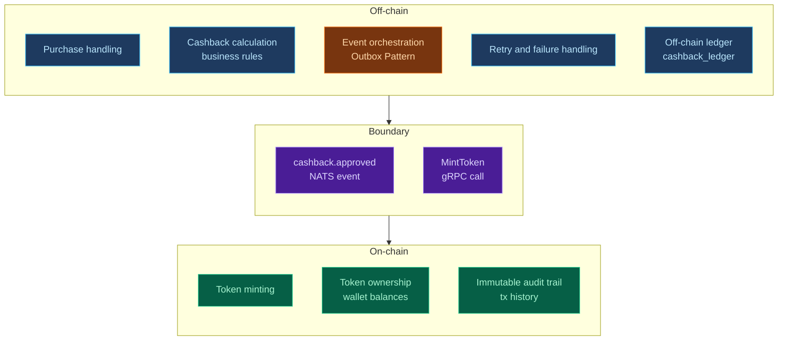

# Off-chain vs On-chain Responsibilities

```mermaid
flowchart TD
    subgraph OFFCHAIN["Off-chain"]
        direction TB
        OC1["Purchase handling"]
        OC2["Cashback calculation\nbusiness rules"]
        OC3["Event orchestration\nOutbox Pattern"]
        OC4["Retry and failure handling"]
        OC5["Off-chain ledger\ncashback_ledger"]
    end

    subgraph BOUNDARY["Boundary"]
        direction TB
        B1["cashback.approved\nNATS event"]
        B2["MintToken\ngRPC call"]
    end

    subgraph ONCHAIN["On-chain"]
        direction TB
        ON1["Token minting"]
        ON2["Token ownership\nwallet balances"]
        ON3["Immutable audit trail\ntx history"]
    end

    OFFCHAIN --> BOUNDARY --> ONCHAIN

    style OC1 fill:#1e3a5f,color:#bae6fd,stroke:#38bdf8
    style OC2 fill:#1e3a5f,color:#bae6fd,stroke:#38bdf8
    style OC3 fill:#78350f,color:#fed7aa,stroke:#f97316
    style OC4 fill:#1e3a5f,color:#bae6fd,stroke:#38bdf8
    style OC5 fill:#1e3a5f,color:#bae6fd,stroke:#38bdf8
    style B1  fill:#4a1d96,color:#ddd6fe,stroke:#a78bfa
    style B2  fill:#4a1d96,color:#ddd6fe,stroke:#a78bfa
    style ON1 fill:#065f46,color:#a7f3d0,stroke:#34d399
    style ON2 fill:#065f46,color:#a7f3d0,stroke:#34d399
    style ON3 fill:#065f46,color:#a7f3d0,stroke:#34d399
```

