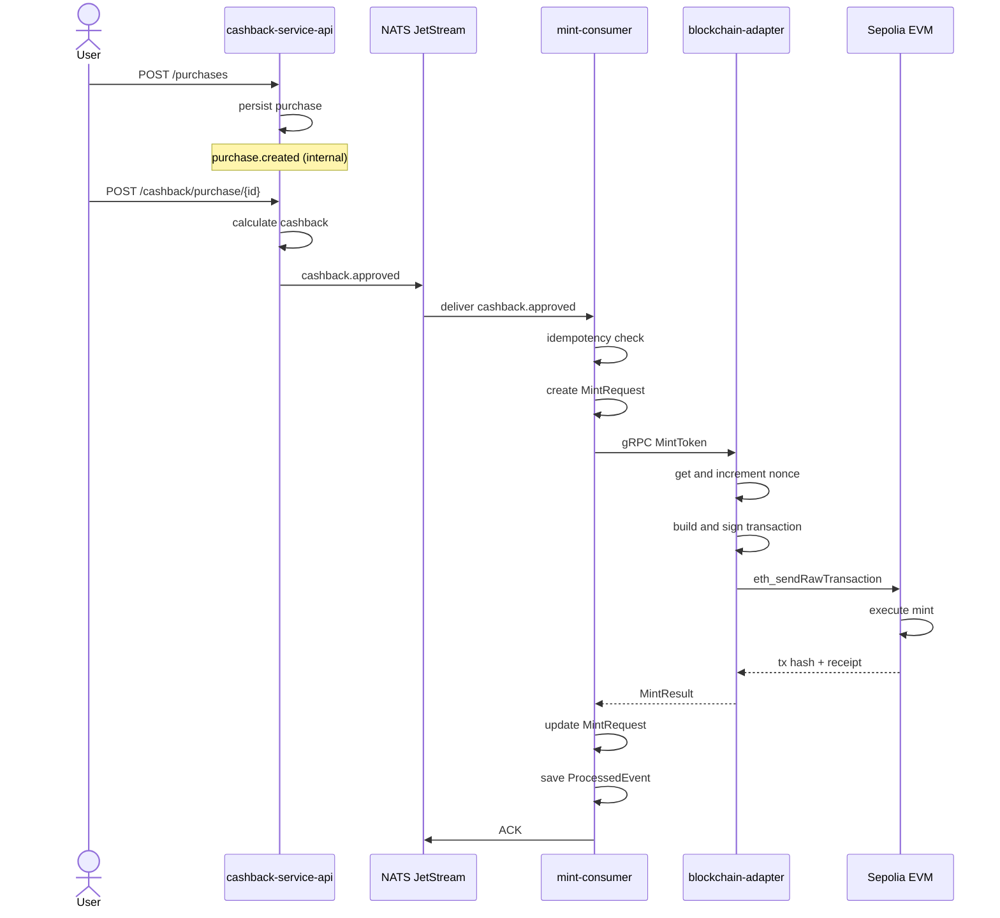
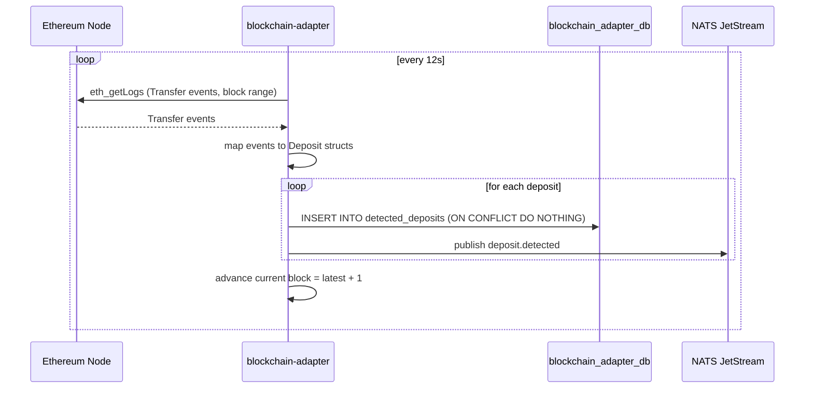

# Domain Events Flow

```mermaid
sequenceDiagram
    actor User
    participant API as cashback-service-api
    participant NATS as NATS JetStream
    participant MC as mint-consumer
    participant BA as blockchain-adapter
    participant Chain as Sepolia EVM

    User->>API: POST /purchases
    API->>API: persist purchase
    Note over API: purchase.created (internal)

    User->>API: POST /cashback/purchase/{id}
    API->>API: calculate cashback
    API->>NATS: cashback.approved

    NATS->>MC: deliver cashback.approved
    MC->>MC: idempotency check
    MC->>MC: create MintRequest
    MC->>BA: gRPC MintToken

    BA->>BA: get and increment nonce
    BA->>BA: build and sign transaction
    BA->>Chain: eth_sendRawTransaction
    Chain->>Chain: execute mint
    Chain-->>BA: tx hash + receipt

    BA-->>MC: MintResult
    MC->>MC: update MintRequest
    MC->>MC: save ProcessedEvent
    MC->>NATS: ACK
```

---

## Deposit Detection Flow

```mermaid
sequenceDiagram
    participant Chain as Ethereum Node
    participant BA as blockchain-adapter
    participant DB as blockchain_adapter_db
    participant NATS as NATS JetStream

    loop every 12s
        BA->>Chain: eth_getLogs (Transfer events, block range)
        Chain-->>BA: Transfer events
        BA->>BA: map events to Deposit structs
        loop for each deposit
            BA->>DB: INSERT INTO detected_deposits (ON CONFLICT DO NOTHING)
            BA->>NATS: publish deposit.detected
        end
        BA->>BA: advance current block = latest + 1
    end
```

