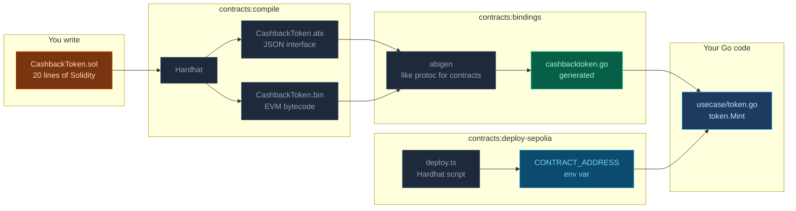

# Blockchain Toolchain

How Solidity becomes callable Go code.

```mermaid
flowchart LR
    subgraph WRITE["You write"]
        SOL["CashbackToken.sol\n20 lines of Solidity"]
    end

    subgraph COMPILE["contracts:compile"]
        HH["Hardhat"]
        ABI["CashbackToken.abi\nJSON interface"]
        BIN["CashbackToken.bin\nEVM bytecode"]
        HH --> ABI
        HH --> BIN
    end

    subgraph BIND["contracts:bindings"]
        ABIGEN["abigen\nlike protoc for contracts"]
        GOFILE["cashbacktoken.go\ngenerated"]
        ABIGEN --> GOFILE
    end

    subgraph DEPLOY["contracts:deploy-sepolia"]
        SCRIPT["deploy.ts\nHardhat script"]
        ADDR["CONTRACT_ADDRESS\nenv var"]
        SCRIPT --> ADDR
    end

    subgraph USE["Your Go code"]
        UC["usecase/token.go\ntoken.Mint"]
    end

    SOL --> HH
    ABI --> ABIGEN
    BIN --> ABIGEN
    GOFILE --> UC
    ADDR --> UC

    style SOL    fill:#78350f,color:#fed7aa,stroke:#f97316
    style HH     fill:#1e293b,color:#94a3b8,stroke:#475569
    style ABI    fill:#1e293b,color:#94a3b8,stroke:#475569
    style BIN    fill:#1e293b,color:#94a3b8,stroke:#475569
    style ABIGEN fill:#1e293b,color:#94a3b8,stroke:#475569
    style GOFILE fill:#065f46,color:#a7f3d0,stroke:#34d399
    style SCRIPT fill:#1e293b,color:#94a3b8,stroke:#475569
    style ADDR   fill:#0c4a6e,color:#7dd3fc,stroke:#0284c7
    style UC     fill:#1e3a5f,color:#bae6fd,stroke:#38bdf8
```

