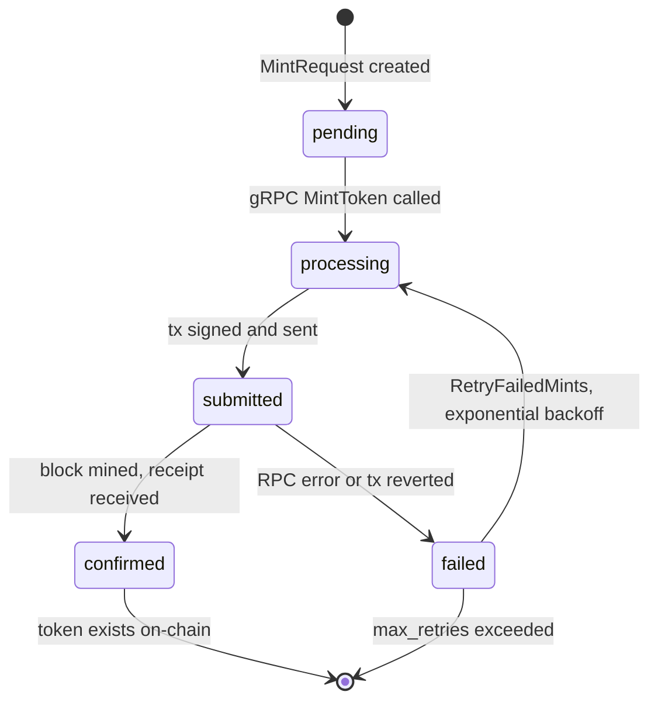

# Transaction Lifecycle

State machine from MintRequest creation to on-chain confirmation.

| State | Fields stored |
|---|---|
| `pending` | `idempotency_key`, `wallet_address`, `token_amount` |
| `submitted` | + `transaction_hash`, `nonce`, `gas_price` |
| `confirmed` | + `block_number`, `gas_used`, `confirmed_at` |
| `failed` | + `error_code`, `error_message` |

