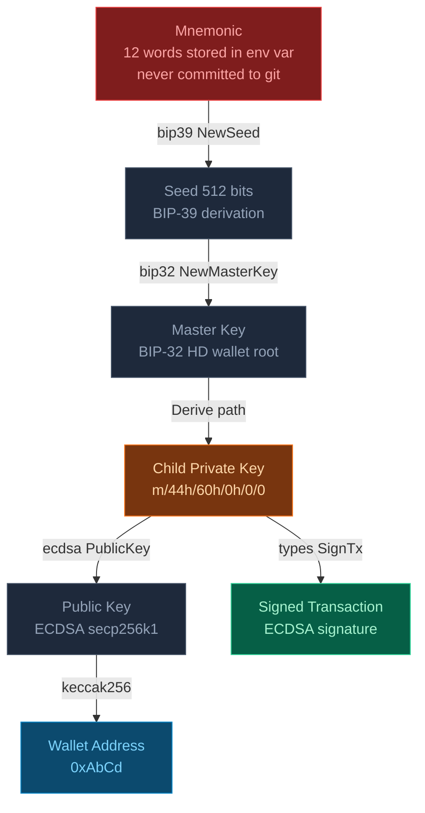

# Wallet and Key Hierarchy

How one mnemonic generates the signing key used by the service.

```mermaid
flowchart TD
    MN["Mnemonic\n12 words stored in env var\nnever committed to git"]
    SEED["Seed 512 bits\nBIP-39 derivation"]
    MASTER["Master Key\nBIP-32 HD wallet root"]
    CHILD["Child Private Key\nm/44h/60h/0h/0/0"]
    PUB["Public Key\nECDSA secp256k1"]
    ADDR["Wallet Address\n0xAbCd"]
    SIG["Signed Transaction\nECDSA signature"]

    MN -- bip39 NewSeed --> SEED
    SEED -- bip32 NewMasterKey --> MASTER
    MASTER -- Derive path --> CHILD
    CHILD -- ecdsa PublicKey --> PUB
    CHILD -- types SignTx --> SIG
    PUB -- keccak256 --> ADDR

    style MN     fill:#7f1d1d,color:#fca5a5,stroke:#ef4444
    style SEED   fill:#1e293b,color:#94a3b8,stroke:#475569
    style MASTER fill:#1e293b,color:#94a3b8,stroke:#475569
    style CHILD  fill:#78350f,color:#fed7aa,stroke:#f97316
    style PUB    fill:#1e293b,color:#94a3b8,stroke:#475569
    style ADDR   fill:#0c4a6e,color:#7dd3fc,stroke:#0284c7
    style SIG    fill:#065f46,color:#a7f3d0,stroke:#34d399
```

