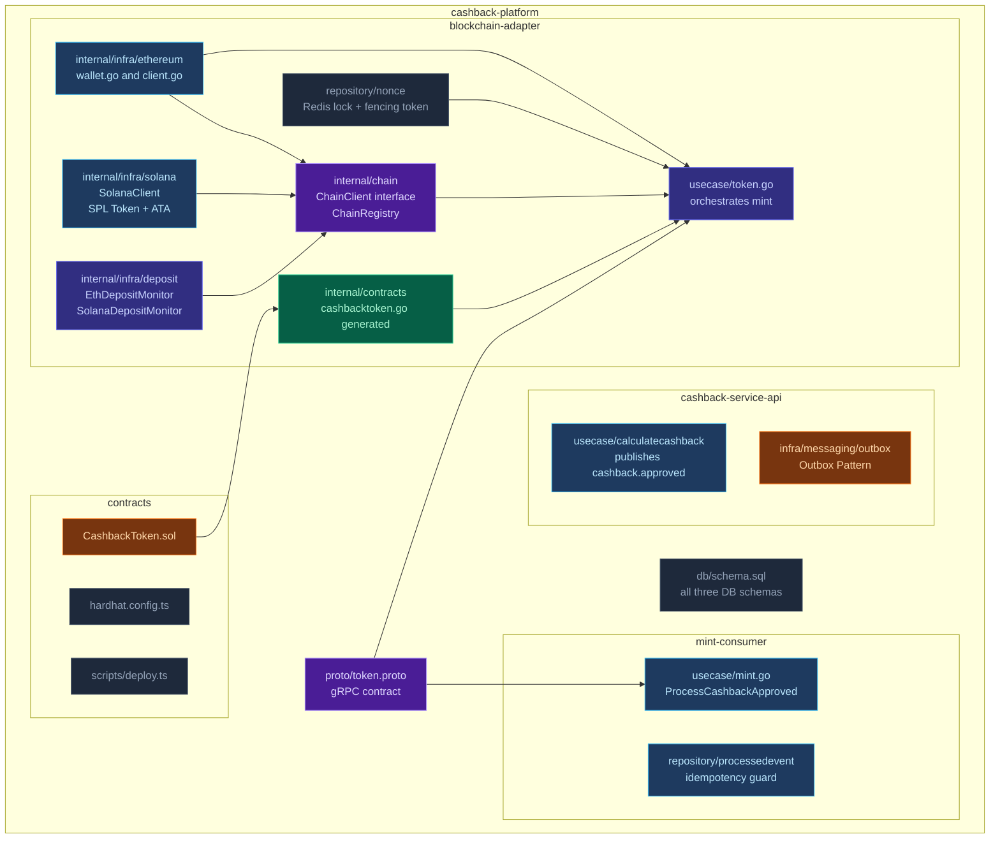

# Repository Structure

Where each concept lives in the codebase.

```mermaid
flowchart TB
    subgraph ROOT["cashback-platform"]
        PROTO["proto/token.proto\ngRPC contract"]
        SCHEMA["db/schema.sql\nall three DB schemas"]

        subgraph CONTRACTS["contracts"]
            SOLFILE["CashbackToken.sol"]
            HCONFIG["hardhat.config.ts"]
            DEPLOY["scripts/deploy.ts"]
        end

        subgraph API_SVC["cashback-service-api"]
            API_UC["usecase/calculatecashback\npublishes cashback.approved"]
            API_OUT["infra/messaging/outbox\nOutbox Pattern"]
        end

        subgraph MINT_SVC["mint-consumer"]
            MINT_UC["usecase/mint.go\nProcessCashbackApproved"]
            MINT_REPO["repository/processedevent\nidempotency guard"]
        end

        subgraph BA_SVC["blockchain-adapter"]
            BA_CONTRACTS["internal/contracts\ncashbacktoken.go generated"]
            BA_ETH["internal/infra/ethereum\nwallet.go and client.go"]
            BA_NONCE["repository/nonce\nRedis lock + fencing token"]
            BA_UC["usecase/token.go\norchestrates mint"]
            BA_CHAIN["internal/chain\nChainClient interface\nChainRegistry"]
            BA_SOL["internal/infra/solana\nSolanaClient\nSPL Token + ATA"]
            BA_DEPOSIT["internal/infra/deposit\nEthDepositMonitor\nSolanaDepositMonitor"]
        end
    end

    PROTO --> MINT_UC
    PROTO --> BA_UC
    SOLFILE --> BA_CONTRACTS
    BA_ETH --> BA_UC
    BA_NONCE --> BA_UC
    BA_CONTRACTS --> BA_UC
    BA_CHAIN --> BA_UC
    BA_ETH --> BA_CHAIN
    BA_SOL --> BA_CHAIN
    BA_DEPOSIT --> BA_CHAIN

    style PROTO        fill:#4a1d96,color:#ddd6fe,stroke:#a78bfa
    style SCHEMA       fill:#1e293b,color:#94a3b8,stroke:#475569
    style SOLFILE      fill:#78350f,color:#fed7aa,stroke:#f97316
    style HCONFIG      fill:#1e293b,color:#94a3b8,stroke:#475569
    style DEPLOY       fill:#1e293b,color:#94a3b8,stroke:#475569
    style API_UC       fill:#1e3a5f,color:#bae6fd,stroke:#38bdf8
    style API_OUT      fill:#78350f,color:#fed7aa,stroke:#f97316
    style MINT_UC      fill:#1e3a5f,color:#bae6fd,stroke:#38bdf8
    style MINT_REPO    fill:#1e3a5f,color:#bae6fd,stroke:#38bdf8
    style BA_CONTRACTS fill:#065f46,color:#a7f3d0,stroke:#34d399
    style BA_ETH       fill:#1e3a5f,color:#bae6fd,stroke:#38bdf8
    style BA_NONCE     fill:#1e293b,color:#94a3b8,stroke:#475569
    style BA_UC        fill:#312e81,color:#c7d2fe,stroke:#6366f1
    style BA_CHAIN     fill:#4a1d96,color:#ddd6fe,stroke:#a78bfa
    style BA_SOL       fill:#1e3a5f,color:#bae6fd,stroke:#38bdf8
    style BA_DEPOSIT   fill:#312e81,color:#c7d2fe,stroke:#6366f1
```

