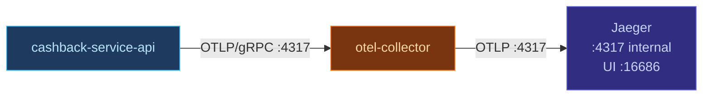

# Observability

Jaeger and the OpenTelemetry Collector start with the default stack. No extra step is needed.

Tracing is enabled by default via `OTEL_ENABLED=true` in `.env.example`. To disable it for a run:

```bash
OTEL_ENABLED=false mise run run:api
```


## Viewing traces

Open [http://localhost:16686](http://localhost:16686). After making any HTTP request to `cashback-service-api`, select the service from the dropdown and click **Find Traces**.


## Pipeline



The collector receives spans from the service, batches them, and forwards to Jaeger over OTLP.


## Verifying

```bash
docker compose ps jaeger otel-collector
curl http://localhost:16686/api/services
```

After the API starts with tracing enabled, `cashback-service-api` appears in the service list.
